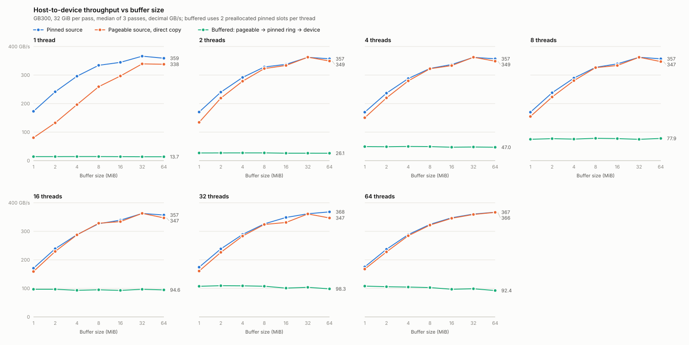

# Pinned staging double-buffer microbenchmark

## Hypothesis

Sirius pins most of host RAM at startup. With the default configuration
(`memory.host.capacity_fraction = 0.9`) cucascade's
`numa_region_pinned_host_memory_resource` calls `numa_alloc_onnode` +
`cudaHostRegister(Portable | Mapped)` on 90% of every NUMA node's RAM before the
first query runs. That is slow to start, slow to tear down, and starves the rest
of the machine of pageable memory.

The alternative under test: leave the data in pageable host memory and stream it
to the GPU through a **small ring of pinned staging slots**:

```text
pageable src --(CPU memcpy, worker thread)--> pinned slot --(cudaMemcpyAsync)--> device
```

Each worker thread owns one CUDA stream and a private ring of `R` slots of
`S` bytes. While the DMA engine drains slot `k`, the worker is already filling
slot `k+1`; it only blocks on a slot's completion event when it comes back
around to that slot. With `R = 2` this is classic double buffering. The question
is whether this reaches the same host-to-device throughput as copying from a
source that is already pinned, using `threads * R * S` bytes of pinned memory
instead of hundreds of GiB.

## What the benchmark measures

`pinned_staging_bench` fills a source buffer with a per-word pattern, copies it
to a full-size device buffer in `S`-byte chunks handed out to `T` worker threads
from an atomic counter, and reports decimal GB/s over the whole dataset (one
warmup pass, then `--iters` measured passes; median and best reported).

| Mode       | Source                                   | Pinned footprint | What it tells you                                  |
| ---------- | ---------------------------------------- | ---------------- | -------------------------------------------------- |
| `pinned`   | already pinned; `cudaMemcpyAsync` chunks | whole dataset    | the ceiling; also times pinning the whole dataset  |
| `pageable` | pageable; `cudaMemcpyAsync` directly     | none             | what the driver's own staging achieves             |
| `memcpy`   | pageable -> pinned ring, no GPU copies   | `T * R * S`      | CPU-side ceiling of stage A alone                  |
| `staged`   | pageable -> pinned ring -> device        | `T * R * S`      | the hypothesis                                     |
| `alloc`    | none                                     | `--total-bytes`  | `cudaHostAlloc` / `cudaHostRegister` + free time   |

For `staged`, the last pass also reports how worker time splits between
`memcpy` (busy copying), `wait` (blocked on a slot's event, i.e. DMA-bound) and
`issue` (CUDA API calls), so a shortfall can be attributed to the CPU side or
the DMA side. `--verify` runs a kernel that checks every destination word
against the pattern.

`staged` has two slot schedulers. `--sched ring` (default) gives each worker a
private ring of `--slots` slots and one stream: the double-buffer design above.
`--sched pool` shares one pool of `--slots` preallocated pinned slots among all
workers: a producer takes any free slot, fills it, issues the copy on one of
`--streams` shared streams round-robin and hands the slot to a reaper thread,
which polls completion events and returns slots to the free list. Producers block
only when every slot is queued on the GPU, so the DMA queue can be as deep as the
pool regardless of producer count. The benchmark prints the peak number of slots
queued at once so the achieved queue depth is visible.

Pinned memory is obtained the way cucascade does it: `--pinned-alloc hostalloc`
uses `cudaHostAlloc(Portable | Mapped)`; `--pinned-alloc register` maps fresh
anonymous memory and calls `cudaHostRegister(Portable | Mapped)` on the
untouched pages, which is what registering a fresh `numa_alloc_onnode` region
costs.

## Build and run

The benchmark is a standalone CMake project (no cudf/cucascade dependency). Run
from the repo root inside the pixi environment:

```bash
pixi run cmake -S bench/pinned_staging -B build/bench/pinned_staging -G Ninja -DCMAKE_BUILD_TYPE=Release
```

```bash
pixi run cmake --build build/bench/pinned_staging
```

Single configurations:

```bash
build/bench/pinned_staging/pinned_staging_bench --mode staged --total-bytes 32G --chunk-bytes 64M --threads 16 --slots 2 --verify
```

```bash
build/bench/pinned_staging/pinned_staging_bench --mode pinned --total-bytes 32G --chunk-bytes 64M --threads 8
```

Full sweep (writes a CSV and prints it as a table; `TOTAL=8G` for a quick run):

```bash
pixi run bench/pinned_staging/run_sweep.sh
```

Options: `--mode`, `--pinned-alloc`, `--total-bytes`, `--chunk-bytes`,
`--threads`, `--slots` (1 disables overlap, a useful control), `--sched ring|pool`,
`--streams K` (pool scheduling), `--iters`,
`--device`, `--verify`, `--huge` (madvise the pageable source with
`MADV_HUGEPAGE`), `--pin-cpus`, `--nvtx` (emit NVTX ranges for nsys), `--csv`,
`--csv-header`.

## Results (GB300, 2026-09-04)

Machine: NVIDIA GB300 (256 GB HBM), Grace Neoverse-V2 with 72 cores on one NUMA
node (506 GB LPDDR5X), NVLink-C2C with ATS enabled, CUDA 13.2 / driver 595.58,
64 KiB base pages, THP in `madvise` mode. Dataset 32 GiB per pass, one warmup
plus three measured passes, median reported in decimal GB/s. Raw CSVs are in
[results/](results/); the sweep is `run_sweep.sh` with `TOTAL=32G`.

### Verdict

**The hypothesis does not hold on this platform.** Staging pageable data through
a pinned ring peaks at about 101 GB/s, 28% of the pinned ceiling, and every
configuration is bound by the CPU memcpy stage (workers spend 95-100% of their
time in `memcpy`, under 5% waiting on DMA). Double buffering is irrelevant here:
`--slots 1`, `2` and `4` land within 3 GB/s of each other because the DMA stage
is 3.5x faster than the CPU stage and never becomes the bottleneck. Replacing the
per-thread rings with a shared pool of up to 256 slots, asynchronous issue on up
to 32 streams and a reaper thread (`--sched pool`) gives the same 100-106 GB/s:
the GPU queue never held more than 13 copies because producers cannot fill slots
as fast as the engine drains them.

**The pinned pool is not what buys the throughput, though.** `cudaMemcpyAsync`
directly from pageable memory matches the pinned source within run-to-run noise
once chunks are 16 MiB or larger, with and without huge pages. On Grace the
copy engine reads pageable memory through ATS, so the startup pinning can be
avoided here by not staging at all rather than by double buffering. Whether that
also holds on x86 + PCIe, where the driver stages pageable copies through its own
small pinned buffers, is the open question this benchmark should be re-run to
answer.

### Throughput vs buffer size, 1 to 64 MiB

<picture>
  <source media="(prefers-color-scheme: dark)" srcset="results/gb300-32G-throughput-vs-buffer-dark.svg">
  
</picture>

One panel per thread count, buffer sizes doubling from 1 to 64 MiB. Buffered is
the ring design with 2 preallocated pinned slots per thread. The grid behind the
chart is `run_grid.sh` (all cells, 32 GiB per pass); the chart and the tables
below come from `plot_results.py`, which merges the result CSVs and writes SVG:

```bash
pixi run bench/pinned_staging/run_grid.sh
```

```bash
python3 bench/pinned_staging/plot_results.py bench/pinned_staging/results/gb300-32G-sweep-2026-09-04.csv bench/pinned_staging/results/gb300-32G-grid-fill-2026-09-04.csv --threads 1,8,32 -o chart.svg
```

Add `--table` for the markdown tables, `--theme dark` for the dark variant, and
`--threads 2,4,16` for other panels (the CSVs hold 1 to 32 threads).

**1 thread** (GB/s)

| Buffer (MiB) | Pinned source | Pageable source | Buffered |
| --- | --- | --- | --- |
| 1 | 173 | 80.5 | 14.1 |
| 2 | 241 | 133 | 14.1 |
| 4 | 296 | 196 | 14.2 |
| 8 | 334 | 259 | 14.3 |
| 16 | 345 | 297 | 14.0 |
| 32 | 366 | 339 | 13.7 |
| 64 | 359 | 338 | 13.7 |

**8 threads** (GB/s)

| Buffer (MiB) | Pinned source | Pageable source | Buffered |
| --- | --- | --- | --- |
| 1 | 170 | 155 | 74.9 |
| 2 | 238 | 223 | 77.1 |
| 4 | 289 | 280 | 75.5 |
| 8 | 327 | 326 | 78.3 |
| 16 | 339 | 334 | 77.2 |
| 32 | 362 | 362 | 74.8 |
| 64 | 357 | 347 | 77.9 |

**32 threads** (GB/s)

| Buffer (MiB) | Pinned source | Pageable source | Buffered |
| --- | --- | --- | --- |
| 1 | 174 | 161 | 107 |
| 2 | 238 | 226 | 109 |
| 4 | 289 | 283 | 109 |
| 8 | 326 | 324 | 108 |
| 16 | 349 | 331 | 101 |
| 32 | 362 | 361 | 104 |
| 64 | 368 | 347 | 98.3 |

What the curves say:

- **Pinned and pageable need big buffers.** Both climb steeply from 1 MiB
  (170 and 160 GB/s) through 8 MiB (about 326) and flatten past 32 MiB (about
  362). The per-copy fixed cost and serialized issue seen in the nsys profiles
  set this curve, and it is the same curve for both sources.
- **Pageable only trails pinned with few threads.** With one thread the pageable
  copy blocks the caller for each transfer, so it needs 32 MiB buffers to get
  within 8% of pinned. From 8 threads up the two lines sit on top of each other
  at every size from 8 MiB.
- **Buffered is flat.** Buffer size does not matter for the staged path, because
  the CPU memcpy stage is the limit at every size: about 14 GB/s per thread,
  75-78 GB/s with 8 threads, 98-109 GB/s with 32. It is the only strategy for
  which 1 MiB buffers cost nothing, and it still delivers less than a third of
  the direct copies.

### Startup cost of pinning (`--mode alloc`)

| Pinned size | `cudaHostAlloc` alloc / free | mmap + `cudaHostRegister` alloc / free |
| ----------- | ---------------------------- | -------------------------------------- |
| 8 GiB       | 431 / 132 ms                 | 368 / 68 ms                            |
| 32 GiB      | 1604 / 547 ms                | 1374 / 281 ms                          |
| 128 GiB     | 5921 / 1837 ms               | 5037 / 966 ms                          |

Roughly 40-45 ms per pinned GiB. The default `capacity_fraction = 0.9` of the
506 GB node comes to about 455 GB, so roughly 20 s of startup and 3.5-6.5 s of
teardown on this box. Backing the registered region with huge pages
(`--pinned-alloc register --huge`) halves registration to 694 ms for 32 GiB and
cuts unregistration to 3 ms.

### Ceiling: source already pinned (`--mode pinned`, GB/s)

| Chunk   | 1 thread | 2   | 4   | 8   | 16  |
| ------- | -------- | --- | --- | --- | --- |
| 1 MiB   | 173      | 171 | 170 | 170 | 171 |
| 16 MiB  | 345      | 338 | 337 | 339 | 339 |
| 64 MiB  | 359      | 357 | 357 | 357 | 357 |
| 256 MiB | 363      | 362 | 362 | 362 | 362 |

At 1 MiB the copy is bound by per-call issue overhead (workers spend over 90% of
their time inside `cudaMemcpyAsync`) and extra threads do not help, so the
runtime is serializing issue. 1 MiB is cucascade's default host block size;
whatever granularity Sirius issues its host-to-device copies at should be
checked against this table.

### Baseline: `cudaMemcpyAsync` from pageable memory (`--mode pageable`, GB/s)

| Chunk   | 1 thread | 2   | 4   | 8   | 16  | 32  |
| ------- | -------- | --- | --- | --- | --- | --- |
| 1 MiB   | 81       | 134 | 150 | 155 | 159 | 161 |
| 16 MiB  | 297      | 334 | 333 | 334 | 334 | 331 |
| 64 MiB  | 338      | 349 | 349 | 347 | 347 | 347 |
| 256 MiB | 348      | 351 | 351 | 350 | 350 | 350 |

Note the call blocks the issuing thread for the whole transfer (`issue` fraction
0.99), so this path needs dedicated copy threads; it is not fire-and-forget the
way a pinned-source `cudaMemcpyAsync` is.

### Stage A alone: pageable to pinned memcpy (`--mode memcpy`, 64 MiB, GB/s)

| Threads | 1    | 2    | 4    | 8    | 16    | 32      | 64    |
| ------- | ---- | ---- | ---- | ---- | ----- | ------- | ----- |
| GB/s    | 14.8 | 28.0 | 52.3 | 95.3 | 119.7 | 132-138 | 128.7 |

One Neoverse-V2 core moves about 14 GB/s; the aggregate saturates near 135 GB/s
at 32 cores and gets no better at 64.

### The hypothesis: pageable to pinned ring to device (`--mode staged`, GB/s)

| Chunk / slots   | 2 threads | 4    | 8    | 16   | 32      | 64   |
| --------------- | --------- | ---- | ---- | ---- | ------- | ---- |
| 16 MiB, 1 slot  | 25.3      | 45.9 | 75.8 | 91.9 | 100.7   | 98.0 |
| 16 MiB, 2 slots | 26.2      | 47.1 | 77.2 | 92.9 | 101.0   | 97.0 |
| 64 MiB, 2 slots | 26.1      | 47.0 | 77.9 | 94.6 | 98-102  | 92.4 |
| 256 MiB, 2 slots| 26.2      | 47.2 | 79.4 | 92.8 | 93.1    | 81.9 |
| 64 MiB, 4 slots | 26.1      | 46.9 | 76.2 | 91.6 | 95.2    | 92.2 |

Staged throughput tracks the memcpy-only curve minus the DMA's share of host
memory bandwidth. `--pin-cpus` and `--huge` did not move it (98 and 94-101 GB/s
at 32 threads). The `--verify` run (64 MiB, 16 threads, 2 slots) checked all
4 Gi words with zero mismatches.

### Deep asynchronous queue: shared pool scheduling (`--sched pool`, GB/s)

To rule out the per-thread ring starving the DMA queue, the same 32 GiB pass was
run with a shared pool of preallocated pinned slots, copies issued asynchronously
on shared streams, and a reaper recycling slots (64 MiB chunks unless noted).
"Peak queued" is the most slots the GPU had in flight at once during the last
pass, as counted by the pool.

| Producers | Pool slots | Streams | Pinned  | Peak queued | GB/s  |
| --------- | ---------- | ------- | ------- | ----------- | ----- |
| 8         | 32         | 8       | 2 GiB   | 7           | 79.5  |
| 8         | 128        | 32      | 8 GiB   | 4           | 74.1  |
| 16        | 32         | 32      | 2 GiB   | 13          | 103.0 |
| 16        | 128        | 32      | 8 GiB   | 12          | 99.7  |
| 32        | 32         | 8       | 2 GiB   | 8           | 103.6 |
| 32        | 128        | 8       | 8 GiB   | 8           | 103.7 |
| 32        | 128        | 32      | 8 GiB   | 9           | 103.0 |
| 32        | 256 (16 MiB) | 32    | 4 GiB   | 6           | 105.7 |
| 64        | 128        | 32      | 8 GiB   | 6           | 93.7  |
| 32, ring  | 2 per producer | 32  | 4 GiB   | -           | 102.5 |

Same result as the ring, within noise. The queue never builds: with 32 producers
a filled slot arrives every 0.66 ms on average (101 GB/s at 64 MiB) while the
engine drains one in 0.36 ms (187 GB/s under contention), so at most 9 of 128
slots were ever queued and producers spent 0-3% of their time waiting for a
slot. More slots, more streams or more producers do not change that; 64
producers on 72 cores is worse. The queue is starved by the producers, and the
producers are slow because they share host memory bandwidth with the DMA.

### Huge pages

`madvise(MADV_HUGEPAGE)` on the source adds about 3.5% for both a pinned and a
pageable source (371 to 383 GB/s at 64 MiB, 8 threads), confirming that the two
are equivalent on this platform rather than one beating the other.

## Profiling with nsys

`profile.sh` takes low-overhead Nsight Systems captures of the key
configurations and runs each one un-profiled as well so the overhead is
measured, not assumed:

```bash
pixi run bench/pinned_staging/profile.sh
```

Overhead is kept low by capturing only the measured passes
(`cudaProfilerStart/Stop` bracket them in the benchmark, used with
`--capture-range=cudaProfilerApi`), tracing only `--trace=cuda,nvtx`, and
turning off CPU sampling, context-switch tracing and backtraces. The benchmark's
`--nvtx` flag adds `pass`, `memcpy`, `wait` and `issue` ranges so worker time can
be attributed on the timeline. Reports land in `build/bench/pinned_staging/nsys/`
as `.nsys-rep` (open in the nsys GUI), `nsys stats` CSVs, and an
`*.analysis.txt` per run produced by `analyze_nsys.py` from the sqlite export
(per-pass DMA busy fraction, peak concurrent copies, per-copy bandwidth
distribution, NVTX stage totals, CUDA API time). The analysis text files and the
overhead table from the GB300 run are in [results/nsys/](results/nsys/).

| Configuration (32 GiB)              | plain GB/s | profiled GB/s | overhead |
| ----------------------------------- | ---------- | ------------- | -------- |
| pinned, 64 MiB, 8 threads           | 370.6      | 366.2         | 1.2%     |
| pageable, 64 MiB, 8 threads         | 369.4      | 365.5         | 1.1%     |
| pinned, 1 MiB, 8 threads            | 176.2      | 137.7         | 21.9%    |
| pageable, 1 MiB, 8 threads          | 161.2      | 129.1         | 19.9%    |
| staged, 64 MiB, 8 threads, 2 slots  | 74.9       | 82.0          | -9.5%    |
| staged, 64 MiB, 32 threads, 2 slots | 102.4      | 101.1         | 1.3%     |
| staged, 64 MiB, 32 threads, 1 slot  | 103.0      | 103.5         | -0.4%    |
| staged, 32 threads, + CPU sampling  | 102.4      | 100.3         | 2.1%     |

Overhead is at the 1-2% level except for the 1 MiB runs, where CUPTI's per-call
cost on 32768 `cudaMemcpyAsync` calls per pass is visible; treat those two
profiles as qualitative. The negative numbers are run-to-run variance.

### What the timelines show

| Configuration                       | DMA busy | peak concurrent copies | per-copy GB/s (median) | aggregate GB/s |
| ----------------------------------- | -------- | ---------------------- | ---------------------- | -------------- |
| pinned, 64 MiB, 8 threads           | 98.8%    | 1                      | 372                    | 366            |
| pageable, 64 MiB, 8 threads         | 98.7%    | 1                      | 371                    | 365            |
| pinned, 1 MiB, 8 threads            | 78%      | 1                      | 179                    | 137            |
| pageable, 1 MiB, 8 threads          | 78%      | 1                      | 166                    | 129            |
| staged, 64 MiB, 8 threads, 2 slots  | 31%      | 1                      | 265                    | 82             |
| staged, 64 MiB, 32 threads, 2 slots | 55%      | 1                      | 187                    | 101            |
| staged, 64 MiB, 32 threads, 1 slot  | 55%      | 1                      | 186                    | 102            |
| pool, 64 MiB, 8 producers, 64 slots, 8 streams    | 30% | 1                | 268                    | 79             |
| pool, 64 MiB, 32 producers, 128 slots, 32 streams | 54% | 1                | 187                    | 101            |

- **One copy engine.** In every profile exactly one host-to-device copy is in
  flight at a time, even with 8 or 32 streams issuing. The copies queue on a
  single engine, and that engine's 372 GB/s is the ceiling on this link.
- **Pageable copies are direct.** CUPTI records each pageable copy as a single
  64 MiB transfer with source kind "pageable" at 371 GB/s, the same as pinned.
  There is no visible driver staging. The `cudaMemcpyAsync` call itself blocks
  for about 1.45 ms with 8 threads, which is the time spent queued behind the
  other threads' copies (8 x 181 us), not staging work.
- **Why 1 MiB chunks lose.** Per-copy bandwidth drops to 179 GB/s (a roughly
  2.7 us fixed cost on a 5.9 us transfer), the engine sits idle 22% of the
  time between copies, and `cudaMemcpyAsync` takes 53 us per call with 8
  threads, about 6.6 us of runtime work per call serialized across threads.
  Workers spend 88% of their time inside the issue call.
- **Why staging stalls at 100 GB/s.** Workers spend 93-99% of their time in
  `memcpy` and at most 2.5% waiting for a slot, even with a single slot, so
  overlap is not the problem. The DMA engine is idle 45-69% of the time and,
  when it does run, its per-copy bandwidth falls from 372 GB/s to 265 GB/s with
  8 memcpy threads and 187 GB/s with 32. The memcpy threads and the copy engine
  are competing for the same LPDDR bandwidth: at 32 threads the host memory
  system is carrying roughly 100 GB/s of memcpy reads, 100 GB/s of memcpy
  writes and 100 GB/s of DMA reads. Staging triples host-memory traffic per
  byte delivered, and that is the wall.
- **A deep asynchronous queue looks identical.** The two `--sched pool` profiles
  show the same DMA busy fraction, the same single copy in flight and the same
  per-copy bandwidth as the ring runs with matching producer counts. The reaper's
  `cudaEventQuery` polling costs 16 ms over three passes (18k calls at 0.9 us),
  and producers waited on slots for 0.1% of their time. nsys overhead on these
  two runs was 0.2% and 2.6%.
- **CPU sampling is unavailable here.** `kernel.perf_event_paranoid` is 4 on
  this box, so nsys disables IP sampling and the `--sample` run is equivalent to
  the trace-only ones. The per-stage attribution above comes from the NVTX
  ranges instead. On a machine that allows sampling, `analyze_nsys.py` prints
  the hot leaf functions (for example, which glibc memcpy variant runs).

## Caveats

- **Platform.** The numbers above are from a Grace Blackwell (GB300) box where
  host and device are connected by NVLink-C2C with ATS enabled. Host-to-device
  bandwidth, single-core memcpy bandwidth and the driver's pageable-copy path
  all differ on x86 + PCIe machines. Re-run the sweep there before generalizing.
- **CPU cost.** Stage A burns CPU cores on memcpy. In production those cores
  compete with decode and DuckDB's own CPU work, so the thread count that wins
  here is an upper bound on what Sirius can afford.
- **Extra memory traffic.** Staging reads the source and writes the pinned slot
  before the DMA reads it again, so host memory bandwidth is consumed twice per
  byte relative to a pinned source.
- **Synthetic source.** The pageable source is fully resident and pre-faulted.
  Data freshly read from disk or produced by DuckDB would be in cache or
  partially unfaulted, which changes the memcpy cost.
