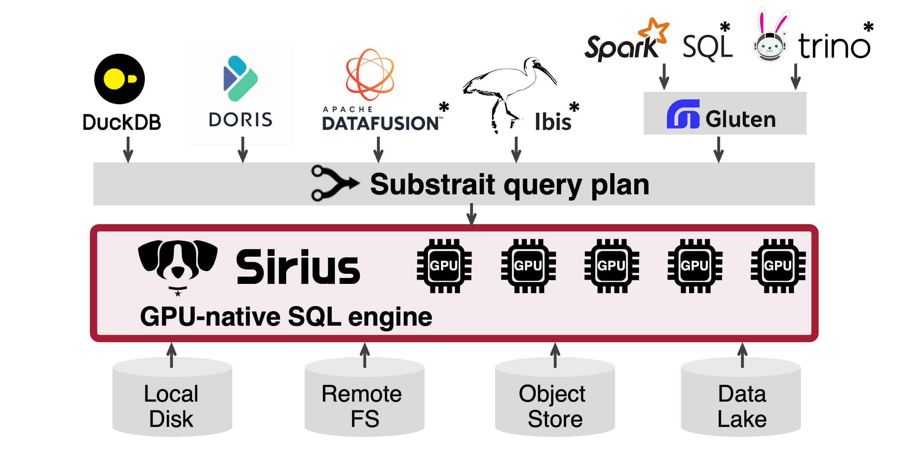

# Sirius
Sirius is a GPU acceleration layer for SQL analytics. It plugs into existing engines such as DuckDB via the standard Substrait query format, requiring no query rewrites or major system changes. Currently supports DuckDB and Doris, other systems marked with * are on our roadmap.



## Installing dependencies
Install duckdb dependencies
```
sudo apt-get update && sudo apt-get install -y git g++ cmake ninja-build libssl-dev
```

If CUDA is not installed in your machine, install cuda from https://developer.nvidia.com/cuda-downloads. Note: Use the deb(local) installer.
After that, perform the post-installation from https://docs.nvidia.com/cuda/cuda-installation-guide-linux/#mandatory-actions.

Check if CUDA is available by running
```
nvcc --version
nvidia-smi
```

Install libcudf dependencies
libcudf will be installed via conda/miniconda. Miniconda can be downloaded [here](https://www.anaconda.com/docs/getting-started/miniconda/install). After downloading miniconda, user can install libcudf via these commands:
```
conda create --name libcudf-env
conda activate libcudf-env
conda install -c rapidsai -c conda-forge -c nvidia rapidsai::libcudf
```
User would need to set the environment variable `USE_CUDF = 1`. User also needs to make sure that the environment variable `LIBCUDF_ENV_PREFIX` is set to the path to the conda environment's directory. For example, if you installed miniconda to the path `~/miniconda3` and you installed libcudf in the conda environment `libcudf-env` then you would set the `LIBCUDF_ENV_PREFIX` to `~/miniconda3/envs/libcudf-env`.
```
export USE_CUDF=1
export LIBCUDF_ENV_PREFIX = {PATH to libcudf-env}
```

Clone the Sirius repository using 
```
git clone --recurse-submodules https://github.com/bwyogatama/sirius.git
cd sirius
export SIRIUS_HOME_PATH=`pwd`
```
Note that `--recurse-submodules` will ensure DuckDB is pulled which is required to build the extension.

## Building
```
cd duckdb
mkdir -p extension_external
cd extension_external
git clone https://github.com/duckdb/substrait.git
cd substrait
git reset --hard ec9f8725df7aa22bae7217ece2f221ac37563da4 #go to the right commit hash for duckdb substrait extension
cd $SIRIUS_HOME_PATH
make -j {nproc} #build extension
```

## Generating TPC-H dataset
Unzip `dbgen.zip` and run `./dbgen -s {SF}`.
To load the TPC-H dataset to duckdb, run this command from the duckdb shell
```
./build/release/duckdb {DATABASE_NAME}.duckdb
.read tpch_load_duckdb.sql
```

## Running Sirius
To run Sirius, simply start the shell with `./build/release/duckdb {DATABASE_NAME}.duckdb`. User first need to initialize the GPU buffer manager using `gpu_buffer_init` API. The `gpu_buffer_init` API accepts 2 parameters, the GPU caching region size and the GPU processing region size. The GPU caching region is a memory region where the raw data is stored in GPUs. The GPUs processing region is a memory region where intermediate results are stored in GPUs/CPUs (hash tables, .etc). Queries will not be able to execute on GPUs if these parameters are unset.
```
call gpu_buffer_init("1 GB", "1 GB")
```

To execute query on GPUs
```
call gpu_processing("select
  l_orderkey,
  sum(l_extendedprice) as revenue,
  o_orderdate,
  o_shippriority
from
  customer,
  orders,
  lineitem
where
  c_mktsegment = 1
  and c_custkey = o_custkey
  and l_orderkey = o_orderkey
  and o_orderdate < 19950315
  and l_shipdate > 19950315
group by
  l_orderkey,
  o_orderdate,
  o_shippriority;")
```
The cold run in Sirius would be significantly slower as Sirius would need to read the data from storage via DuckDB and perform conversion from the DuckDB format to Sirius native format. The hot run would be significantly faster as the data would be cached on the device memory.

All 22 TPC-H queries are in tpch-queries.sql. To run all the TPC-H queries:
```
.read tpch-queries.sql
```

## Testing
We have a unittest for Sirius to compare all the TPC-H query results with DuckDB. To run the unittest, the user first need to generate SF=1 TPC-H dataset using method described [here](https://github.com/sirius-db/sirius?tab=readme-ov-file#generating-tpc-h-dataset). After that, to run the unittest:
```
make test
```

## Performance
By offloading query execution to GPUs, Sirius achieves over 10× speedup at the same hardware rental cost, making it well-suited for interactive analytics, financial workloads, and ETL jobs. To get the optimum performance, running Sirius on Grace architectures are recommended.
